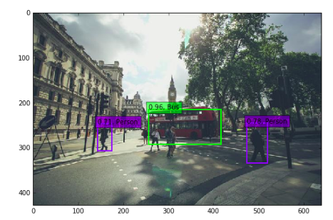

# 概要
ROSトピックで受講した画像からSSDで物体検出

アルゴリズムはこれ
* https://github.com/weiliu89/caffe/tree/ssd

利用した実装はこれ
* https://github.com/rykov8/ssd_keras

利用する重み付けデータはこれ
* https://mega.nz/#F!7RowVLCL!q3cEVRK9jyOSB9el3SssIA

# 起動準備
* レポジトリのダウンロード
````
cd ~/catkin_ws/src
git clone https://github.com/raucha/ssd_ros
````
* ライブラリのインストール
  * (CPU版)`sudo -H pip install keras tensorflow`
  * （GPU版）`sudo -H pip install keras tensorflow-gpu`
* ダウンロードした`weights_SSD300.hdf5`を適当な場所におき，`model.load_weights(....)`を編集してパスを通す

# 起動
`rosrun pythontest ssd_ros.py`

カメラはこれとかを使って画像のトピックを流す
* http://wiki.ros.org/uvc_camera

# 発行トピック
### 識別結果文字列
* topic: /class_num [std_msgs/String]
* 出力：ラベル，検出された四角形の座標，四角形の辺の長さ(別物体は別トピックとして出力される)
  * [ラベル, x_min, y_min, x_length, y_length]
### 識別結果画像
* topic: /classed_image [sensor_msgs/Image]



# 購読トピック
topic: /usb_cam/image_raw

